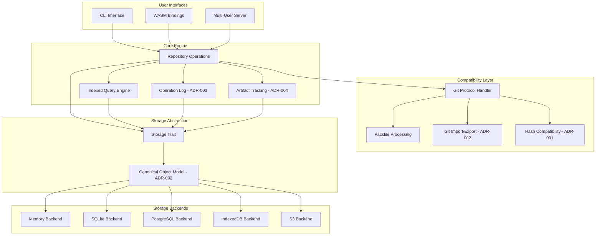

# GitNext

## Overview

GitNext is a next-generation Git implementation written in pure Rust that addresses fundamental limitations of existing Git implementations while maintaining full compatibility with the Git ecosystem. The system is built around a modular, storage-agnostic architecture that supports multiple deployment targets including CLI, browser (WASM), embedded systems, and cloud environments.

The core design principles are:
- **Memory Safety**: Leveraging Rust's ownership system to prevent crashes and data corruption
- **Performance**: Utilizing parallel processing, efficient data structures, and optimized algorithms
- **Modularity**: Clean separation of concerns with pluggable storage backends and protocol handlers
- **Compatibility**: Full interoperability with existing Git infrastructure and workflows
- **Extensibility**: Advanced features like undo/redo, indexed queries, and artifact tracking

## Architecture

The GitNext system follows a layered architecture with clear separation between core functionality, storage abstraction, protocol handling, and user interfaces. The architecture is governed by key architectural decisions that establish compatibility boundaries and extensibility points.

### Architectural Decision Records (ADRs)

The following architectural decisions define GitNext's core design principles:

**ADR-001: Dual-Hash Strategy**
- **Primary Identity**: BLAKE3 (256-bit) for all internal operations (identity, deduplication, indexing)
- **Compatibility Hash**: SHA-1/SHA-256 derived at Git compatibility boundaries only
- **Rationale**: Enables high performance and strong cryptographic properties while maintaining Git compatibility

**ADR-002: Canonical Object Model**
- **Internal Representation**: GitNext defines its own canonical object model (Blob, Tree, Commit, Tag)
- **Git Format**: Treated as import/export representation only, not internal storage constraint
- **Rationale**: Enables storage-agnostic backends and extensible metadata without Git format limitations

**ADR-003: Operation Log as First-Class Primitive**
- **Persistent Logging**: All repository mutations recorded with before/after states and command intent
- **Undo/Redo**: Implemented via operation replay/reversal, not heuristic ref manipulation
- **Rationale**: Guarantees recoverability and enables deterministic history replay

**ADR-004: Artifact Tracking as Orthogonal Layer**
- **Stable Identifiers**: Artifacts (functions, types, modules) have stable IDs independent of file paths
- **Non-Intrusive**: Artifact metadata doesn't affect Git object hashes or compatibility
- **Rationale**: Enables semantic analysis while preserving Git compatibility

### Compatibility Contract

GitNext maintains behavioral compatibility with Git through formal guarantees:

**Import Compatibility**: Any valid Git repository can be imported with full preservation of commit graphs, file contents, and references.

**Export Compatibility**: GitNext repositories can be exported to standard Git format with identical commit history and file contents.

**Round-Trip Fidelity**: Git → GitNext → Git preserves commit DAG, file contents, tree structure, and reference resolution.

**Extension Isolation**: GitNext-specific features (artifacts, operation logs) are orthogonal to Git compatibility and safely ignored by standard Git tools.



## Components and Interfaces

### Core Data Model (gitnext-core, gitnext-objects)

The foundation of GitNext is a canonical object model that maintains Git compatibility while enabling extensibility. Following **ADR-002**, GitNext defines its own internal representation rather than mimicking Git's on-disk format.

**Dual-Hash Identity System (ADR-001)**:
- **Primary Identity**: BLAKE3 hashes for all internal operations
- **Compatibility Hashes**: SHA-1/SHA-256 computed at import/export boundaries
- **Content-Based Identification**: Objects identified by cryptographic hashes of canonical content
- **Hash Agility**: Future-proof design supporting algorithm evolution

```rust
// Canonical object model with dual-hash support
pub struct ObjectId {
    primary_hash: Blake3Hash,    // Internal identity (ADR-001)
    compat_hash: Option<GitHash>, // Git compatibility hash
}

pub enum GitHash {
    Sha1([u8; 20]),
    Sha256([u8; 32]),
}

// Canonical object types (ADR-002)
pub enum GitObject {
    Commit(Commit),
    Tree(Tree),
    Blob(Blob),
    Tag(Tag),
}

// Immutable commit structure with canonical serialization
pub struct Commit {
    tree: ObjectId,
    parents: Vec<ObjectId>,
    author: Signature,
    committer: Signature,
    message: String,
    // Canonical serialization ensures deterministic hashing
}
```

**Canonical Serialization**: All objects have deterministic canonical serialization that enables:
- Consistent BLAKE3 hash computation across platforms
- Reliable Git-compatible hash derivation
- Storage-agnostic representation

### Storage Abstraction (gitnext-storage)

The storage layer provides a unified interface for different backend implementations:

```rust
#[async_trait]
pub trait Storage: Send + Sync {
    async fn store_object(&self, id: &ObjectId, object: &GitObject) -> Result<()>;
    async fn load_object(&self, id: &ObjectId) -> Result<Option<GitObject>>;
    async fn list_refs(&self) -> Result<Vec<Reference>>;
    async fn update_ref(&self, name: &str, target: &ObjectId) -> Result<()>;
    async fn transaction(&self) -> Result<Box<dyn Transaction>>;
}

#[async_trait]
pub trait Transaction: Send + Sync {
    async fn store_object(&mut self, id: &ObjectId, object: &GitObject) -> Result<()>;
    async fn update_ref(&mut self, name: &str, target: &ObjectId) -> Result<()>;
    async fn commit(self: Box<Self>) -> Result<()>;
    async fn rollback(self: Box<Self>) -> Result<()>;
}
```

### Repository Operations (gitnext-operations)

Repository operations provide the core Git functionality:

```rust
pub struct Repository {
    storage: Arc<dyn Storage>,
    operation_log: OperationLog,
    query_engine: QueryEngine,
}

impl Repository {
    pub async fn init(storage: Arc<dyn Storage>) -> Result<Self>;
    pub async fn commit(&self, tree: &ObjectId, message: &str) -> Result<ObjectId>;
    pub async fn create_branch(&self, name: &str, target: &ObjectId) -> Result<()>;
    pub async fn merge(&self, branch: &str, strategy: MergeStrategy) -> Result<MergeResult>;
    pub async fn undo(&self) -> Result<()>;
    pub async fn redo(&self) -> Result<()>;
}
```

### Operation Logging (gitnext-operations)

Following **ADR-003**, the operation log is a first-class system primitive that enables universal undo/redo and crash-safe recovery:

```rust
pub struct OperationLog {
    storage: Arc<dyn Storage>,
    current_position: usize,
}

// Comprehensive operation recording (ADR-003)
pub struct LogEntry {
    id: Uuid,
    timestamp: DateTime<Utc>,
    operation: Operation,
    before_state: RepositoryState,
    after_state: RepositoryState,
    command_intent: CommandIntent, // Original user command
    user_metadata: UserMetadata,
}

pub enum Operation {
    Commit { 
        before_head: Option<ObjectId>, 
        after_head: ObjectId,
        tree: ObjectId,
        message: String,
        parents: Vec<ObjectId>,
    },
    CreateBranch { 
        name: String, 
        target: ObjectId,
        before_refs: HashMap<String, ObjectId>,
    },
    Merge { 
        branch: String, 
        before_head: ObjectId, 
        after_head: ObjectId,
        strategy: MergeStrategy,
    },
    // All repository mutations recorded
}

impl OperationLog {
    pub async fn record(&mut self, op: Operation) -> Result<()>;
    pub async fn undo(&mut self) -> Result<Option<Operation>>;
    pub async fn redo(&mut self) -> Result<Option<Operation>>;
    pub async fn replay_from(&self, position: usize) -> Result<()>;
    pub async fn compact(&mut self, keep_entries: usize) -> Result<()>;
}
```

**Deterministic Replay**: Operations can be replayed deterministically for crash recovery and debugging.
**Crash Safety**: All operations are logged before execution, enabling recovery from any failure point.
**Compaction**: Log compaction preserves essential history while managing storage growth.

### Indexed Query Engine (gitnext-query)

Fast repository analysis through pre-built indices:

```rust
pub struct QueryEngine {
    storage: Arc<dyn Storage>,
    commit_index: CommitIndex,
    ancestry_index: AncestryIndex,
}

pub struct CommitIndex {
    // B-tree index for fast commit lookup by various criteria
    by_author: BTreeMap<String, Vec<ObjectId>>,
    by_date: BTreeMap<DateTime<Utc>, Vec<ObjectId>>,
    by_message: BTreeMap<String, Vec<ObjectId>>,
}

pub struct AncestryIndex {
    // Generation numbers for O(log n) ancestry queries
    generations: HashMap<ObjectId, u64>,
    // Reachability index for fast merge-base computation
    reachability: ReachabilityIndex,
}

impl QueryEngine {
    pub async fn ancestors(&self, commit: &ObjectId) -> Result<Vec<ObjectId>>;
    pub async fn is_ancestor(&self, ancestor: &ObjectId, descendant: &ObjectId) -> Result<bool>;
    pub async fn merge_base(&self, a: &ObjectId, b: &ObjectId) -> Result<Option<ObjectId>>;
    pub async fn filter_commits(&self, filter: CommitFilter) -> Result<Vec<ObjectId>>;
}
```

### Artifact Tracking (gitnext-identity)

Following **ADR-004**, artifact tracking provides semantic analysis capabilities as an orthogonal layer:

```rust
// Artifact tracking orthogonal to Git compatibility (ADR-004)
pub struct ArtifactTracker {
    storage: Arc<dyn Storage>,
    artifact_index: ArtifactIndex,
}

pub struct Artifact {
    stable_id: ArtifactId,        // Stable across file moves/renames
    artifact_type: ArtifactType,  // Function, Type, Module, etc.
    location: ArtifactLocation,   // Current location in repository
    metadata: ArtifactMetadata,   // Custom annotations
}

pub enum ArtifactType {
    Function { signature: String, language: String },
    Type { name: String, language: String },
    Module { path: String, language: String },
    Class { name: String, language: String },
    Custom { type_name: String, data: serde_json::Value },
}

pub struct ArtifactLocation {
    commit: ObjectId,
    file_path: String,
    line_range: Option<(u32, u32)>,
    byte_range: Option<(u64, u64)>,
}

impl ArtifactTracker {
    pub async fn track_artifact(&mut self, artifact: Artifact) -> Result<()>;
    pub async fn query_artifacts(&self, query: ArtifactQuery) -> Result<Vec<Artifact>>;
    pub async fn get_artifact_history(&self, id: &ArtifactId) -> Result<Vec<ArtifactVersion>>;
    pub async fn find_artifact_references(&self, id: &ArtifactId) -> Result<Vec<ArtifactReference>>;
}

// Artifact metadata doesn't affect Git object hashes (ADR-004)
pub struct ArtifactMetadata {
    annotations: HashMap<String, serde_json::Value>,
    created_at: DateTime<Utc>,
    last_modified: DateTime<Utc>,
    tags: Vec<String>,
}
```

**Orthogonal Design**: Artifact data is completely separate from Git objects and doesn't affect compatibility.
**Stable Identity**: Artifacts maintain stable IDs even when files are moved or renamed.
**Semantic Queries**: Enables analysis of code structure evolution over time.
**Optional Layer**: Can be disabled without affecting core Git functionality.

### Git Protocol Handler (gitnext-protocol)

Handles Git compatibility through import/export and protocol translation, implementing the compatibility contract:

```rust
pub struct ProtocolHandler {
    transport: Box<dyn Transport>,
    hash_converter: HashConverter, // ADR-001 dual-hash support
}

// Git compatibility layer (ADR-002)
pub struct GitCompatibilityLayer {
    canonical_to_git: ObjectConverter,
    git_to_canonical: ObjectImporter,
}

#[async_trait]
pub trait Transport: Send + Sync {
    async fn connect(&mut self, url: &str) -> Result<()>;
    async fn list_refs(&mut self) -> Result<Vec<Reference>>;
    async fn fetch_packfile(&mut self, wants: &[ObjectId], haves: &[ObjectId]) -> Result<PackFile>;
    async fn send_packfile(&mut self, packfile: PackFile) -> Result<()>;
}

// Packfile handling with hash conversion
pub struct PackFile {
    objects: Vec<PackedObject>,
    index: PackIndex,
    hash_type: GitHashType, // SHA-1 or SHA-256 for Git compatibility
}

impl ProtocolHandler {
    pub async fn clone(&self, url: &str, repo: &Repository) -> Result<()>;
    pub async fn fetch(&self, url: &str, repo: &Repository) -> Result<()>;
    pub async fn push(&self, url: &str, repo: &Repository, refs: &[RefUpdate]) -> Result<()>;
    
    // Import/export with compatibility guarantees
    pub async fn import_git_repository(&self, git_repo: &GitRepository) -> Result<Repository>;
    pub async fn export_to_git(&self, repo: &Repository) -> Result<GitRepository>;
}

// Hash conversion between BLAKE3 and Git hashes (ADR-001)
pub struct HashConverter {
    blake3_to_sha1: HashMap<Blake3Hash, Sha1Hash>,
    sha1_to_blake3: HashMap<Sha1Hash, Blake3Hash>,
}

impl HashConverter {
    pub fn compute_git_hash(&self, object: &GitObject, hash_type: GitHashType) -> GitHash;
    pub fn lookup_canonical_id(&self, git_hash: &GitHash) -> Option<ObjectId>;
}
```

**Compatibility Guarantees**:
- **Import Fidelity**: All Git objects, commit graphs, and references preserved exactly
- **Export Fidelity**: Exported repositories work with standard Git clients
- **Round-Trip**: Git → GitNext → Git preserves all Git-visible data
- **Extension Isolation**: GitNext extensions don't affect Git compatibility

### WASM Support (gitnext-wasm)

Browser compatibility through WebAssembly bindings:

```rust
#[wasm_bindgen]
pub struct WasmRepository {
    inner: Repository,
}

#[wasm_bindgen]
impl WasmRepository {
    #[wasm_bindgen(constructor)]
    pub async fn new() -> Result<WasmRepository, JsValue>;
    
    #[wasm_bindgen]
    pub async fn commit(&self, message: &str) -> Result<String, JsValue>;
    
    #[wasm_bindgen]
    pub async fn create_branch(&self, name: &str) -> Result<(), JsValue>;
    
    #[wasm_bindgen]
    pub async fn query_commits(&self, filter: &str) -> Result<Array, JsValue>;
}
```

## Data Models

### Object Storage Format

Objects are stored using efficient binary serialization:

```rust
// Optimized binary format for internal storage
#[derive(Serialize, Deserialize)]
pub struct StoredObject {
    object_type: ObjectType,
    data: Vec<u8>,
    metadata: ObjectMetadata,
}

#[derive(Serialize, Deserialize)]
pub struct ObjectMetadata {
    size: u64,
    created_at: DateTime<Utc>,
    hash_algorithm: HashType,
}
```

### Index Structures

Indices are maintained for fast query operations:

```rust
// Commit graph index for ancestry queries
#[derive(Serialize, Deserialize)]
pub struct CommitGraphIndex {
    nodes: Vec<CommitNode>,
    edges: Vec<(u32, u32)>, // parent-child relationships
    generation_numbers: Vec<u64>,
}

#[derive(Serialize, Deserialize)]
pub struct CommitNode {
    object_id: ObjectId,
    parents: Vec<u32>, // indices into nodes array
    children: Vec<u32>,
    generation: u64,
}
```

### Operation Log Schema

Operations are stored for undo/redo functionality:

```rust
#[derive(Serialize, Deserialize)]
pub struct LogEntry {
    id: Uuid,
    timestamp: DateTime<Utc>,
    operation: Operation,
    before_state: RepositoryState,
    after_state: RepositoryState,
}

#[derive(Serialize, Deserialize)]
pub struct RepositoryState {
    head: Option<ObjectId>,
    refs: HashMap<String, ObjectId>,
    index_state: Option<IndexState>,
}
```

Now I need to use the prework tool to analyze the acceptance criteria before writing the correctness properties section.
## Correctness Properties

*A property is a characteristic or behavior that should hold true across all valid executions of a system-essentially, a formal statement about what the system should do. Properties serve as the bridge between human-readable specifications and machine-verifiable correctness guarantees.*

Based on the requirements analysis, the following correctness properties ensure GitNext operates correctly across all scenarios:

### Property 1: Repository Clone Consistency
*For any* valid Git repository, cloning it with GitNext should produce a repository that contains all the same objects and references as the original.
**Validates: Requirements 1.2**

### Property 2: Commit Operation Integrity
*For any* repository state and valid changes, committing those changes should create a commit object with correct parent relationships and update the repository state appropriately.
**Validates: Requirements 1.3**

### Property 3: Branch Operation Consistency
*For any* repository and branch name, creating a branch and switching to it should result in the working directory reflecting the branch's target commit.
**Validates: Requirements 1.4**

### Property 4: Merge Operation Correctness
*For any* two branches with a common ancestor, merging them should produce a commit that incorporates changes from both branches according to three-way merge semantics.
**Validates: Requirements 1.5**

### Property 5: Git Format Compatibility
*For any* GitNext repository, the objects and references should be readable by standard Git tools, and vice versa.
**Validates: Requirements 1.6**

### Property 6: Storage Backend Behavioral Consistency
*For any* sequence of repository operations, executing them on different storage backends should produce identical final repository states.
**Validates: Requirements 2.7**

### Property 7: Git Protocol Push Compliance
*For any* valid repository changes, pushing them to a Git server using GitNext should result in the same server state as pushing with standard Git.
**Validates: Requirements 3.1**

### Property 8: Git Protocol Pull Compliance
*For any* Git server state, pulling changes with GitNext should result in the same local repository state as pulling with standard Git.
**Validates: Requirements 3.2**

### Property 9: Packfile Format Compatibility
*For any* set of Git objects, creating a packfile with GitNext should produce a packfile that can be read by standard Git tools, and vice versa.
**Validates: Requirements 3.3**

### Property 10: Git Object Format Compliance
*For any* Git object (commit, tree, blob, tag), the binary representation created by GitNext should be identical to that created by standard Git.
**Validates: Requirements 3.5**

### Property 11: Operation Logging Completeness
*For any* repository mutation operation, the operation should be recorded in the operation log with sufficient information to undo it.
**Validates: Requirements 4.1**

### Property 12: Undo Operation Correctness
*For any* repository operation that has been performed, undoing it should restore the repository to its exact previous state.
**Validates: Requirements 4.2**

### Property 13: Redo Operation Consistency
*For any* operation that has been undone, redoing it should restore the repository to the same state as if the operation had never been undone.
**Validates: Requirements 4.3**

### Property 14: Operation History Persistence
*For any* sequence of operations performed before application restart, the operation history should be identical after restart.
**Validates: Requirements 4.4**

### Property 15: Undo/Redo Coverage Completeness
*For any* mutation operation (commit, branch, merge, etc.), the operation should be undoable and redoable.
**Validates: Requirements 4.5**

### Property 16: Index Maintenance Consistency
*For any* commit added to a repository, all relevant indices should be updated to reflect the new commit's presence.
**Validates: Requirements 5.1**

### Property 17: Commit Filtering Accuracy
*For any* commit filter criteria (author, date, message, file changes), the filtered results should contain exactly those commits that match the criteria.
**Validates: Requirements 5.3**

### Property 18: Diff Operation Correctness
*For any* two commits, the diff between them should accurately represent all changes between their tree states.
**Validates: Requirements 5.4**

### Property 19: Incremental Index Updates
*For any* repository with existing indices, adding new commits should update the indices to include the new commits without affecting existing entries.
**Validates: Requirements 5.5**

### Property 20: Index Consistency After Structural Changes
*For any* repository structural change (branch deletion, reference updates), all indices should remain consistent with the new repository structure.
**Validates: Requirements 5.6**

### Property 21: WASM Progress Reporting
*For any* long-running operation in WASM environment, progress should be reported at regular intervals with monotonically increasing completion percentages.
**Validates: Requirements 6.4**

### Property 22: WASM Functional Parity
*For any* repository operation, executing it in WASM environment should produce the same result as executing it in native environment.
**Validates: Requirements 6.6**

### Property 23: Concurrent Operation Safety
*For any* set of concurrent repository operations by multiple users, the final repository state should be equivalent to some sequential execution of those operations.
**Validates: Requirements 8.2**

### Property 24: Protocol Translation Correctness
*For any* GitNext operation requested through Git protocol, the operation should be translated and executed correctly, producing the expected Git protocol response.
**Validates: Requirements 8.4**

### Property 25: Failure Recovery Consistency
*For any* operation that fails partway through execution, the repository should remain in a consistent state with no partial modifications.
**Validates: Requirements 10.2**

### Property 26: Data Integrity Validation
*For any* stored object, its cryptographic hash should match its content, and any corruption should be detected during validation.
**Validates: Requirements 10.3**

### Property 27: Corruption Detection and Recovery
*For any* detected data corruption, the system should report the corruption clearly and attempt recovery where possible without losing uncorrupted data.
**Validates: Requirements 10.4**

### Property 28: Atomic Operation Guarantee
*For any* repository operation, it should either complete entirely or leave the repository in its original state with no partial changes.
**Validates: Requirements 10.5**

### Property 29: Object ID Stability
*For any* object in a repository, its stable identifier should remain constant across all repository operations that don't modify the object's content.
**Validates: Requirements 11.1**

### Property 30: Artifact Relationship Preservation
*For any* object modification, the system should maintain traceable relationships between the new version and all previous versions.
**Validates: Requirements 11.2**

### Property 31: Provenance Query Accuracy
*For any* object with modification history, querying its provenance should return accurate information about all previous versions and modifications.
**Validates: Requirements 11.3**

### Property 32: Version Link Maintenance
*For any* object that is modified, links to its previous versions should be maintained and accessible through the artifact tracking system.
**Validates: Requirements 11.4**

### Property 33: Stable Identifier Lookup Efficiency
*For any* stable object identifier, looking up the corresponding object should succeed in reasonable time regardless of repository size.
**Validates: Requirements 11.5**

### Property 34: Artifact Metadata Preservation
*For any* artifact with associated metadata or annotations, the metadata should be preserved across all repository operations that don't explicitly modify it.
**Validates: Requirements 11.6**

### Property 35: Cross-Platform Behavioral Consistency
*For any* repository operation, executing it on different supported platforms should produce identical results.
**Validates: Requirements 12.4**

## Error Handling

GitNext implements comprehensive error handling to ensure robust operation and clear diagnostics:

### Error Type Hierarchy

```rust
#[derive(Debug, thiserror::Error)]
pub enum GitNextError {
    #[error("Storage error: {0}")]
    Storage(#[from] StorageError),
    
    #[error("Protocol error: {0}")]
    Protocol(#[from] ProtocolError),
    
    #[error("Object error: {0}")]
    Object(#[from] ObjectError),
    
    #[error("Operation error: {0}")]
    Operation(#[from] OperationError),
    
    #[error("Index error: {0}")]
    Index(#[from] IndexError),
}

#[derive(Debug, thiserror::Error)]
pub enum StorageError {
    #[error("Object not found: {id}")]
    ObjectNotFound { id: ObjectId },
    
    #[error("Transaction failed: {reason}")]
    TransactionFailed { reason: String },
    
    #[error("Corruption detected in object {id}: {details}")]
    CorruptionDetected { id: ObjectId, details: String },
    
    #[error("Storage backend unavailable: {backend}")]
    BackendUnavailable { backend: String },
}
```

### Error Recovery Strategies

1. **Transactional Operations**: All mutations are wrapped in transactions that can be rolled back on failure
2. **Corruption Recovery**: Automatic detection and recovery from corrupted objects using redundant data
3. **Graceful Degradation**: System continues operating with reduced functionality when non-critical components fail
4. **Operation Retry**: Automatic retry with exponential backoff for transient failures
5. **State Validation**: Continuous validation of repository state with automatic repair when possible

### Error Reporting

- **Structured Errors**: All errors include structured information for programmatic handling
- **User-Friendly Messages**: CLI and UI provide clear, actionable error messages
- **Error Context**: Full error chains preserved for debugging
- **Recovery Suggestions**: Errors include suggestions for resolution when possible

## Testing Strategy

GitNext employs a comprehensive testing strategy combining unit tests, property-based tests, integration tests, and performance benchmarks.

### Unit Testing

Unit tests focus on specific examples, edge cases, and error conditions:

- **Component Isolation**: Each component tested in isolation with mocked dependencies
- **Edge Case Coverage**: Explicit tests for boundary conditions and error scenarios
- **Example Validation**: Concrete examples that demonstrate correct behavior
- **Error Path Testing**: Verification of error handling and recovery mechanisms

### Property-Based Testing

Property-based tests verify universal properties across all inputs using **QuickCheck for Rust (quickcheck crate)**:

- **Minimum 100 iterations** per property test to ensure comprehensive input coverage
- **Custom Generators**: Specialized generators for Git objects, repository states, and operations
- **Shrinking Support**: Automatic reduction of failing test cases to minimal examples
- **Property Tagging**: Each test tagged with format: **Feature: gitnext-platform, Property {number}: {property_text}**

Example property test structure:
```rust
#[quickcheck]
fn property_clone_consistency(repo: ArbitraryRepository) -> bool {
    // Feature: gitnext-platform, Property 1: Repository Clone Consistency
    let cloned = clone_repository(&repo.url).unwrap();
    repositories_equivalent(&repo.inner, &cloned)
}
```

### Integration Testing

Integration tests verify component interactions and end-to-end workflows:

- **Multi-Component Scenarios**: Tests spanning multiple system components
- **Protocol Compliance**: Verification against real Git servers and clients
- **Storage Backend Testing**: Identical test suites run against all storage backends
- **WASM Environment Testing**: Full test suite execution in browser environment

### Performance Benchmarking

Performance tests ensure GitNext meets its performance goals:

- **Benchmark Suites**: Comprehensive benchmarks using **Criterion.rs**
- **Regression Detection**: Automated detection of performance regressions
- **Comparative Analysis**: Performance comparison against standard Git
- **Scalability Testing**: Performance validation with large repositories

### Test Organization

```
tests/
├── unit/                    # Unit tests for individual components
│   ├── storage/
│   ├── operations/
│   ├── protocol/
│   └── query/
├── property/                # Property-based tests
│   ├── repository_ops.rs
│   ├── storage_backends.rs
│   └── protocol_compliance.rs
├── integration/             # Integration tests
│   ├── end_to_end.rs
│   ├── git_compatibility.rs
│   └── multi_user.rs
└── benchmarks/              # Performance benchmarks
    ├── clone_performance.rs
    ├── query_performance.rs
    └── storage_performance.rs
```

### Continuous Integration

- **Multi-Platform Testing**: Automated testing on Linux, macOS, and Windows
- **Multi-Architecture Testing**: Testing on x86_64 and ARM64 architectures
- **Browser Testing**: Automated WASM testing in headless browsers
- **Performance Monitoring**: Continuous performance regression detection
- **Coverage Reporting**: Code coverage tracking with minimum thresholds

### Test Data Management

- **Synthetic Repositories**: Generated test repositories with known properties
- **Real Repository Testing**: Testing against actual open-source repositories
- **Stress Testing**: Large-scale repository testing for scalability validation
- **Corruption Testing**: Intentional corruption injection for recovery testing
